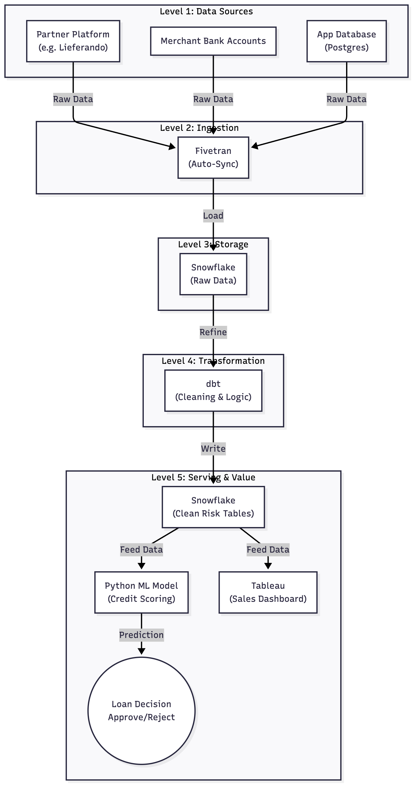

# Design Decisions & Architecture

## 1. Architecture Overview

This project implements a standard ELT pipeline using **dbt** and **Snowflake**.

- **Ingestion:** Raw CSV data is seeded directly into Snowflake.
- **Transformation:** Data is cleaned and modeled in dbt to create a Transformed table (`transformed_sales_data`) serving as the single source for analytics.
- **Analysis:** Business questions are answered via SQL queries referencing the transformed model.

## 2. Key Decisions

### Data Ingestion Strategy

* **Choice:** Used `dbt seed` to upload the sales and customer data.
* **Reasoning:** Since the provided files are small and don't change, `dbt seed` is the best choice. It keeps the data inside the project folder, so anyone can download and run the code immediately without needing extra setup. In a real project with millions of rows, I would use a tool like Fivetran instead.

### Transformation Logic

* **Date Handling:** The dates in the CSV were just text (var_char). I converted them into real Date objects so Snowflake understands them correctly and we can easily extract the Month and Year without errors.
* **Data Quality Filtering:** I only included orders where the status is 'Completed'. If we count 'Cancelled' or 'Pending' orders, our revenue numbers will be wrong, which would mislead the business.
* **Schema Design:** I built the final table to be flat and easy to read. This means analysts can get answers directly from this one table without needing to write complicated code to join multiple tables together.

### Assumptions (based on business understanding)

* **Currency:** All transactions are assumed to be in EUR.
* **Uniqueness:** `order_id` is assumed to be a unique primary key.
* **Data Flow:** [created using mermaid chart].
  I researched Banxware's architecture and found a detailed case study on Fivetran's website. It confirms your stack is Fivetran for ingestion, Snowflake for storage, and dbt for transformation. That is why I designed my diagram to match this exact flow.

 

  
   
  <em>Hypothetical End-to-End Data Flow</em>

 
