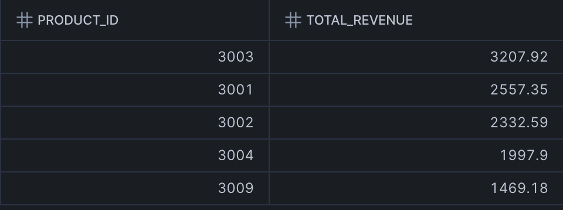
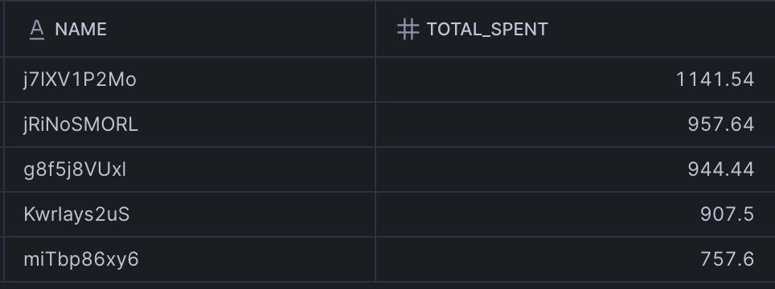
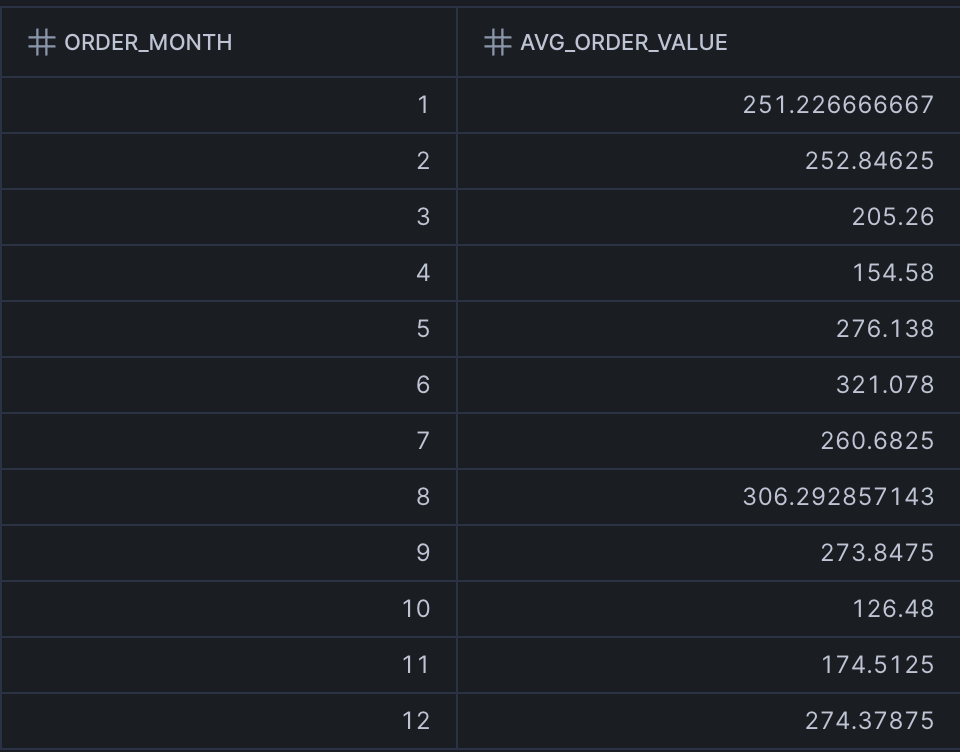
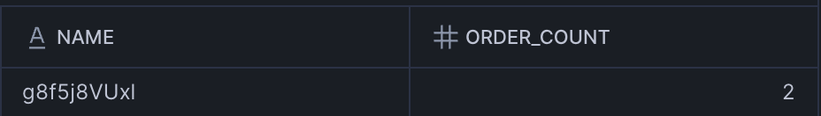

# Query Execution Results (screenshots from Snowflake)

(from queries/query_verification.sql)

1. What are the top 5 products by total sales amount in the year 2023?

### 2. What are the names of the top 5 customers by total sales amount in the year 2023?

### 3. What is the average order value for each month in the year 2023?

### 4. Which customer had the highest order volume in the month of October 2023?

